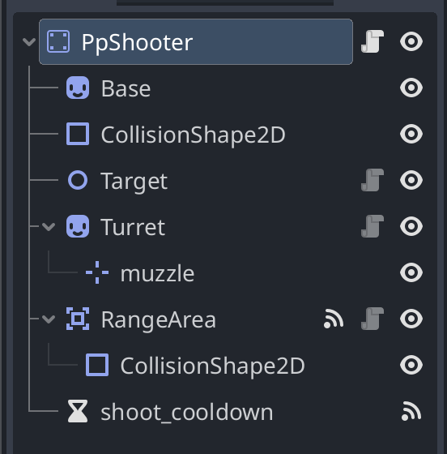

# Implementing Towers
## Overview
> So you want to make some new towers eh?

This project is meant to be a practice in game programming architecture and organization. I tried to make each part of the game easy to extend and build upon. But I'm still learning so it may not be exactly straightforward yet.

### Where are Towers Located?

I started storing content related to towers in a `towers` folder under the `entities` folder. Each tower inside of the towers folder will also be its own folder. Ideally, each towers' folder will also store any of its specific assets - like sprites and sounds.

### What Exactly is a Tower?

All towers will extend a base component called `Tower` which you can find in the `base_tower` folder. The `pp_shooter` tower is basically complete and its current organization looks like so:

As you can see from the image, towers consist of the following elements at the moment:
- A base
  - This is just the sprite that makes up the tower's base
- A `CollisionShape2D`
  - This is a required component of nodes extending from `StaticBody2D` and has no function
- `Target` - nothing now, and might never be something
- `Turret`
  - This is a bit of a confusing component at the moment. Currently it is serving as the visual part of towers that moves. It also contains some functions related to shooting and following a target. This will likely be the primary area that you would add functionality for new kinds of towers - whether it's extending from the original script - or adding new child components.
  - For more clarity - new kinds of towers will likely overload the `shoot()` function in the base turret script.
- `RangeArea`
  - This is also confusing at the moment. The `RangeArea` is the turrets detection range for shooting at enemies. Enemies that enter it will become targets of the turret.
- `shoot_cooldown`
  - A little self explanatory. Set the cooldown of the turret node to the desired fire rate.
